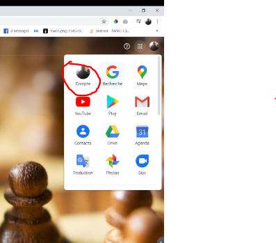
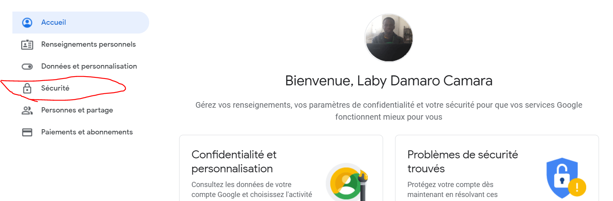
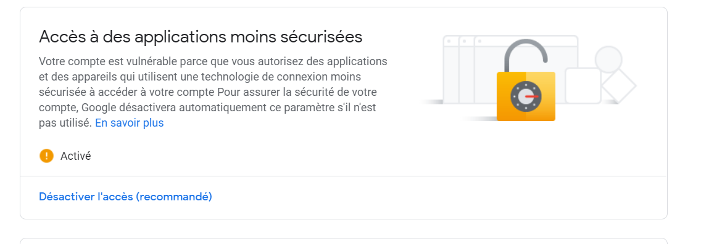
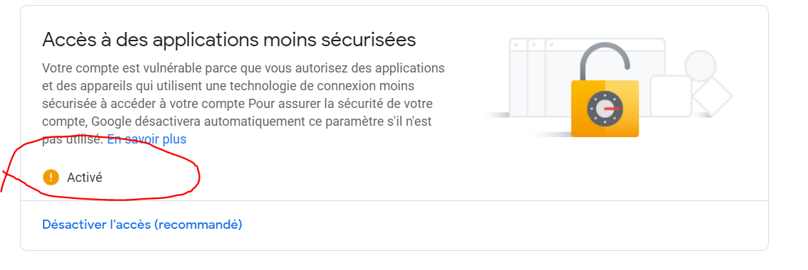

# camara-spring-email-notification
Mon api de notification email en spring

## Rest API URL

* Envoie d'un Simple Text(HTML)

Envoyer un mail sous format **HTML** : <code>http://localhost:8080/notification/textemail</code> , **method : POST , Mediatype : application/json** dans le corps de la requêt : { "sendTo" : "ldc@gmail.com,y@gmail.com", "subject" : "Test", "body" : "Bonjour" }

* Envoie d'un fichier(png, jpg, jpe, gif,...)

Envoyer un mail sous format d'un **fichier** : <code>http://localhost:8080/v1/notification/attachemail</code> , **method : POST from-data**: key = file et la valeur est le fichier à télécharger dans le corps de la requêt : { "sendTo" : "xyz@gmail.com,y@gmail.com", "subject" : "Test", "body" : "Hello" }

* Les configurations
Ici, nous donnons l'adresse e-mail des destinataires dans les fichiers de propriétés <code>src/main/resources/application.properties</code> de cette configuration <code>email.address=xyz@gmail.com,y@gmail.com,etc...</code>

* Configuration de son compte gmail 
Il est impératif d'aller dans sur son compte gmail

1. Se connecter sur son compte
2. Aller au 
<code>Application Google-->Compte --> Sécurité --> Accès à des applications moins sécurisées</code>
ou en anglais
 <code>Google Account --> Security --> Less secure app access</code>
3. Activer:
           **Accès à des applications moins sécurisées** ou en si votre navigateur est anglais 
           **Less secure app access**

### quelques images pour vous guider:
*   Paramètre:
	
*   Sécurite
    
*   Accèss aux apps moins sécurisées
    
*   Aciver
    

